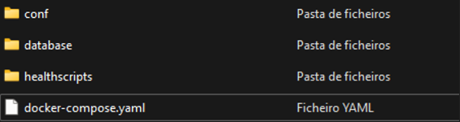
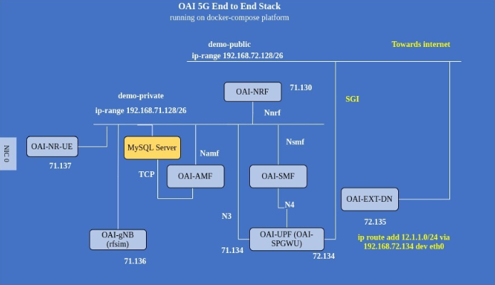
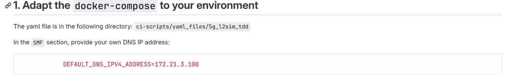
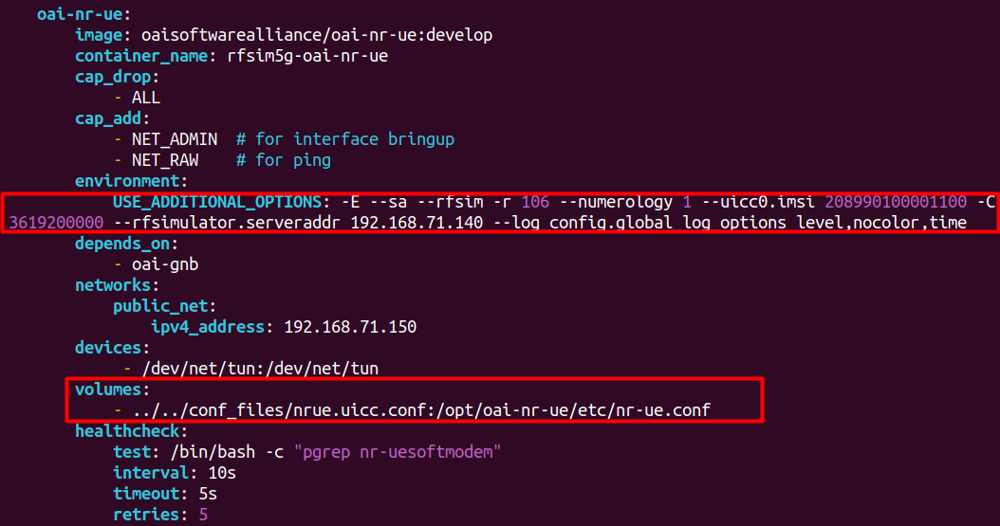

<!-- PROJECT LOGO -->
<br />
<div align="center">
  <h3 align="center">Mosaic5G Documentation</h3>
  <p align="center">
    @DEI.FCTUC
  </p>
  <br>
</div>

<!-- TABLE OF CONTENTS -->
<details>
  <summary>Table of Contents</summary>
  <ol>
    <li>
      <a href="#Introduction">Introduction</a>
    </li>
    <li>
      <a href="#useful-links">Useful Links</a>
    </li>
    <li><a href="#Mosaic5G">Mosaic5G</a></li>
      <ul>
        <li><a href="#Documentation">Documentation</a></li>
        <ul>
          <li><a href="#1-flexran-rtc">flexran-rtc</a></li>
          <li><a href="#2-jox">jox</a></li>
          <li><a href="#3-kube5g">kube5G</a></li>
          <li><a href="#4-ll-mec">ll-mec</a></li>
          <li><a href="#5-oai-cn">oai-cn</a></li>
          <li><a href="#6-oai-ran--oai-ue">oai-ran & oai-ue</a></li>
          <li><a href="#7-ovs-gtp">ovs-gtp</a></li>
          <li><a href="#8-store">store</a></li>
        </ul>
      </ul>
    <li><a href="#OAI">OAI</a></li>
        <ul>
        <li><a href="#Documentation">Documentation</a></li>
        <li><a href="#Implementations">Implementations</a></li>
        <ul>
          <li><a href="#1. OAI-CN Deployment">OAI-CN</a></li>
          <li><a href="#2.Full-Stack Implementation">Full Stack Implementation</a></li>
        </ul>
        </ul>
    <li><a href="#acknowledgments">Acknowledgments</a></li>
  </ol>
  <br>
</details>
<br>

# Introduction
The following `readme` tries to make sense of the enumerous projects and subprojects that the current *Mosaic5G* project has of today. We will approach the Mosaic5G repository available on Github and Gitlab, and the OAI repository available only on Gitlab.

It (more or less) tries to follow, for all the mechanisms and components of the 5G Network (and sometimes 4G LTE), this basic template: 
  1. A small summary about what is the component
  2. The last known update for the project repository
  3. The key elements: not necessarily the subprojects, but the main features, or main utilities or mechanisms inside within the component
  4. Required packages for the instantiation of the component
  5. Supported OS and Kernel (with some recommended hardware settings, if mencioned)
  6. Additional Comments

# Useful Links

These descriptions where retrieved from the following links and articles provided inside of these: 

```md
Project Link: https://deiucpt.sharepoint.com/sites/MOSAIC5G
Mosaic5G Home Website: https://mosaic5g.io/
```

These are the repositories that are useful: 
  - **github** project folder for [mosaic5g](https://github.com/simula/mosaic5g-mosaic5g/tree/master)
  - **gitlab** project folder for [mosaic5g](https://gitlab.eurecom.fr/mosaic5g)
  - **gitlab** project folder for [oai](https://gitlab.eurecom.fr/oai/cn5g)


# Mosaic5G

##  **Documentation**

## 1. flexran-rtc

```md
Platform to apply the *Software Defined Networking* principle at the RAN domain that enables software defined RAN (SD-RAN).
```

> Authored 3 years ago

It is the real-time access network controller. It is composed by 2 main key elements (*software speaking*): 

  - **RTC or Real time controller**: enables coordinated control over multiple RANs, reveals high/low-level primitives and provision SDKs for control application.
  - **RAN Runtime**: acts as a local agent controlled by RTC, virtualizes the underlying RAN radio resources, pipelines the RAN service function chain, and provides SDKs enabling distributed control applications. Further, the RAN runtime can support various slice requirements (e.g., isolation) and also improve multiplexing benefits (e.g., sharing) in terms of radio resource abstractions and modularized/customized RAN compositions for RAN slicing purpose.

Essentially it aims to provide a programmable architecture for SD-RANs. It aims to separate the control and data plane of the RAN.

### Required Packages:

```bash
Cmake >= 3.5
libprotobuf v3.3.0
boost >= 1.54 (libboost-system-dev, libboost-program-options-dev)
log4cxx >= 0.10.0 (liblog4cxx-dev liblog4cxx10v5)
curl-dev (libcurl4-openssl-dev)
Compiler with support for C++11
Pistache library (e.g. later than Nov 22, 2017) for RESTful northbound API support
Optionally: nodejs >= 4.2.6
```

These packages are only required if you are not running the script `install_dependencies` in the tools directory. *Otherwise, we must install these dependencies individually to run the build.*

### Supported Versions: 
```bash
Ubuntu 16.04 and 18.04 (no specified kernel version)
```


## 2. jox


```md
This is an event-driven Juju-based service orchestrator core with several plugins to interact with different network domains, e.g., RAN and CN
```

> Authored 4 years ago

The JOX architecture includes two main components: 
  - **JOX core:** comprises both JSlice (representing each slice as a set of models with a policy) and JCloud (host and control the underlying cloud resources) controllers to control slice and cloud resources respectively.
  - **JOX plugin framework**: enables different plugins for RAN, CN, MEC, and VIM to enable fast reactions like event handling and monitoring.

Essentially, using JOX we can define network slices that can be independently optimized with specific configurations on its resources, network functions, and service chains. 

### Required Packages:

```bash
Juju version 2.5.1 (Juju version 2+ recommended)
```

These packages are only required if you are not running the script `install_dependencies` located in the tools directory.

### Supported Versions: 
```bash
Ubuntu 14.04, 16.04 and 18.04 (no specified kernel version)
Testbed w/ Ubuntu VM, 5G RAM, 12GB Memory.
```

## 3. kube5G

```md
Cloud-Native Agile 5G Service Platforms. 
```

> Authored 4 years ago

This project does not represent a specific element of a 5G network like the last ones. It simply aims to facilitate the deployment and management of 4G/5G network and services in cloud like environments - kubernetes and OpenShitft. 

Within the project we get:
  - **Dockers**: contains tools and scripts for building Docker images of OpenAirInterface (OAI) and deploying 4G/5G networks using Docker and Docker Compose.
  - **Kubernetes**: contains examples and configurations for deploying 4G/5G networks using Kubernetes.
  - **OpenShift**: includes the m5g-operator, which is described as an orchestrator tool for managing 5G services in Kubernetes deployments.

With Kube5G we can deploy services on a VM , or any private/public cloud for R&D of cellular mobile networks and 5G purposes.

Every component of these 3 has diferent requirements:

#### Required Packages for docker/kubernets implementation: 

```bash
- One PC with Ubuntu 16.04/18.04 with (preferable) 8GB RAM
- Kubernetes deployment microk8s
- Snap enabled
- An USRP (as frontend) attached to the PC
- Commecial phone equipped with SIM card to be connected to the network

- GigaByte Box with ubuntu 16.04 and 16 BG RAM
- microk8s version: v1.14.10
- kubectl version: 1.17.3
- USRP: B210 mini
- Phone: Google pixel 2
```


#### Required Packages for Openshift (m5g-operator): 

```bash
Operator SDK v0.15.2
Golang 1.12+
Docker 17.03+
kubectl v1.11.3+
a Kubernetes environment (microk8s or minikube, etc)
Optional: [dep][https://golang.github.io/dep/docs/installation.html] version v0.5.0+.
Optional: delve version 1.2.0+ (for up local --enable-delve).

An above average machine (the testbed used was a i7-8700k, 16gb ram)
Ubuntu 18.04
```


## 4. ll-mec

```md
Low latency mobile/multi-RAT edge computing and core network controller platform. Core Network (CN) & Edge Controller is an ETSI-aligned MEC platform that can act as a software-defined core network controller.
```

> Authored 4 years ago

Within the LL-MEC platform, two main services are provided: 
  - **Edge packet service (EPS)** - (equivalent to traffic rule control) that manages the static and dynamic traffic rules and handles multiple OpenFlow libraries and OVS.
  - **Radio network information service (RNIS)** - extracts real-time RAN information (e.g., user and radio bearer statistics) and delegates the control decision over the user plane.

> *Note: the OVS or Open vSwitch is mencioned in another section, because it is included in a different subproject*. 

With LL-MEC we can develop RAN & CN network applications by leveraging LL-MEC and FlexRAN SDKs.

### Required Packages:

```bash
libssl-dev
autoconf
libtool
CMake version 2.8 or newer
GCC version 4.8.1 or newer (for c++11 support)
```

### Supported Versions: 
```bash
Ubuntu 16.04 and 18.04 | Kernel 4.9.0
```

## 5. oai-cn

```md
Implementation of OpenAirInterface Core Network.
```

> Authored 5 years ago

This is an implementation of a 3GPP compliant specificationEvolved Packet Core Network, with the following network elements: MME, HSS, S-GW, P-GW. The OAI-CN is in support of ll-mec (the controller). 

> *Note: for the documentation of this subsection we had to follow the github project, because the gitlab meta project is only available under subscription under eurocom accounts.* 

### Required Packages:

```bash
No required packages as they are all retrieved from the docker-compose script.
```

### Supported Versions: 
```bash
The CN without LL-MEC on snap has no special kernel dependencies. Some issues with kernel 4.15 have been observed and fixed.
```

## 6. oai-ran & oai-ue

```md
3GPP compliant implementations of 5G and LTE/LTE-A RAN.
```

> Extremely Recent

The documentation for this subproject is extense. This is a small summary:
  - The [**OAI EPC**](https://github.com/OPENAIRINTERFACE/openair-epc-fed/blob/master/docs/DEPLOY_HOME_MAGMA_MME.md) and [**OAI 5G Core**](https://gitlab.eurecom.fr/oai/cn5g/oai-cn5g-fed/-/blob/master/docs/DEPLOY_HOME.md) is developed in disctinct projects with their own documentation.
  - OAI softmodem sources, that aim to implement 3GPP compliant UEs, eNodeB and gNodeB can be downloaded from this [repository](https://gitlab.eurecom.fr/oai/openairinterface5g/-/blob/develop/doc/GET_SOURCES.md)
  - All of the sources are installed automatically with the build command. 
  - A list of [features](https://gitlab.eurecom.fr/oai/openairinterface5g/-/blob/develop/doc/FEATURE_SET.md) is also provided.
  - There are also some build tutorials for all the [subsubprojects](https://gitlab.eurecom.fr/oai/openairinterface5g/-/blob/develop/doc/BUILD.md) available (all the specific elements of the RAN & UE)


### Required Packages:

```bash
No required packages.
```

### Supported Versions: 
```bash
Ubuntu 18, 20, 22
Redhat 8, 9
Fedora 3.7
```

## 7. ovs-gtp


```md
OVS Switching with GTP Patch
```
This is an open-source implementation of a distributed virtual multilayer switch. The main purpose of OpenvSwitch is to provide a switching stack for hardware virtualization environments, while supporting multiple protocols and standards used in computer networks.

> Authored 4 years ago

This subproject is implemented as a necessary part of the ll-mec - in order to run ll-mec we need OpenvSwitching with GTP ability. 

### Required Packages:

```bash
- CMake version 2.8 or newer
- GCC version 4.8.1 or newer (for c++11 support)
```

### Supported Versions: 
```bash
Ubuntu 18.04, 16.04
```

## 8. store


```md
The network store - a repository of network functions, controll applications, SDK, charms, templates, images, tools and datasets.
```
> Authored 6 years ago

From the article mencioned previously (available in the project folder mencioned in the first section) we get:
*The Store is in form of a distribution repository that contains a constellation of platform packages, SDKs, control applications, datasets and models. It aims to develop and bundle plug-and-play (P&P) network applications tailored to a particular use case, and also to compose and customize a network service delivery platform across reusable applications. Each control application has its control purpose, and it relies on different granularities of net-work status information from the platform SDK and may further provide APIs to other control applications.*

There are different projects inside this subproject. The main one is flexRAN SDK, a software development kit, that has been developed to facilitate the use of the API that is exposed by flexRAN-rtc. Several applications have been made with this sdk:
  - RRM
  - monitoring
  - spectrum sharing apps
  - docker deployments of full topologies
  - kubernetes cluster deployment


### Required Packages:

```bash
Nothing was specified
```

### Supported Versions: 
```bash
Nothing was specified
```

# OAI

##  **Documentation**

## **Implementations**

### 1. OAI-CN Deployment

> 4GB de memoria, 8 processadores, 25GB de disco (15 utilizados para a CN) - [Ubuntu 22.04 LTS](https://releases.ubuntu.com/22.04/ubuntu-22.04.4-desktop-amd64.iso)
> 

####  Pre-requisites

Começamos por instalar o docker para o ubuntu.

```bash
sudo apt install -y git net-tools putty

# instalar o docker para o ubuntu.

# https://docs.docker.com/engine/install/ubuntu/
sudo apt install -y ca-certificates curl gnupg
sudo install -m 0755 -d /etc/apt/keyrings
curl -fsSL https://download.docker.com/linux/ubuntu/gpg | sudo gpg --dearmor -o /etc/apt/keyrings/docker.gpg
sudo chmod a+r /etc/apt/keyrings/docker.gpg
echo "deb [arch="$(dpkg --print-architecture)" signed-by=/etc/apt/keyrings/docker.gpg] https://download.docker.com/linux/ubuntu "$(. /etc/os-release && echo "$VERSION_CODENAME")" stable" | sudo tee /etc/apt/sources.list.d/docker.list > /dev/null
sudo apt update

sudo apt install -y docker-ce docker-ce-cli containerd.io docker-buildx-plugin docker-compose-plugin

# Add your username to the docker group, otherwise you will have to run in sudo mode.
sudo usermod -a -G docker $(whoami)
reboot 
```

#### Config Files

Fazer download dos ficheiros de config de: `https://gitlab.eurecom.fr/oai/openairinterface5g/-/archive/develop/openairinterface5g-develop.zip?path=doc/tutorial_resources/oai-cn5g.`

Este ficheiro contém: 



O docker compose contêm: 

1. **mysql**:
    - **container_name**: "mysql"
    - **image**: mysql:8.0
    - **volumes**:
        - Monta um script SQL inicial (`oai_db.sql`) para iniciar o banco de dados.
        - Monta um script de healthcheck (`mysql-healthcheck.sh`) para monitorizar a saúde do serviço MySQL.
    - **environment**: Define variáveis de ambiente, como o fuso horário e credenciais do banco de dados.
    - **healthcheck**: Especifica um comando para verificar a saúde do serviço MySQL.
    - **networks**: Atribui um endereço IP estático ao conteiner no `public_net`.
2. **ims** (IP Multimedia Subsystem):
    - **container_name**: "ims"
    - **image**: oaisoftwarealliance/ims
    - **volumes**: Monta arquivos de configuração SIP e utilizadores.
    - **healthcheck**: Usa `pgrep` para verificar se o processo `asterisk` está em execução.
    - **networks**: Atribui um endereço IP estático ao conteiner no `public_net`.
3. **oai-udr** (Unified Data Repository):
    - **container_name**: "oai-udr"
    - **image**: oaisoftwarealliance/oai-udr
    - **volumes**: Monta um arquivo de configuração `config.yaml`.
    - **environment**: Define o fuso horário.
    - **depends_on**: Especifica dependências de outros conteiners (mysql, oai-nrf).
    - **networks**: Atribui um endereço IP estático ao conteiner no `public_net`.
4. **oai-udm** (Unified Data Management):
    - Similar ao `oai-udr`, mas depende do `oai-udr`.
5. **oai-ausf** (Authentication Server Function):
    - Similar ao `oai-udm`, mas depende do `oai-udm`.
6. **oai-nrf** (Network Repository Function):
    - Similar ao `oai-udr`, mas sem dependências adicionais.
7. **oai-amf** (Access and Mobility Management Function):
    - Similar ao `oai-udr`, mas depende de vários serviços (`mysql`, `oai-nrf`, `oai-ausf`).
8. **oai-smf** (Session Management Function):
    - Similar ao `oai-udr`, mas depende de `oai-nrf` e `oai-amf`.
9. **oai-upf** (User Plane Function):
    - Similar ao `oai-udr`, mas com capacidades adicionais (`NET_ADMIN`, `SYS_ADMIN`) e é privilegiado.
    - Depende de `oai-nrf` e `oai-smf`.
10. **oai-ext-dn** (External Data Network):
    - **privileged**: true, indica que o conteiner tem privilégios elevados.
    - **init**: true, garante que o sistema de init é usado.
    - **container_name**: oai-ext-dn
    - **image**: oaisoftwarealliance/trf-gen-cn5g
    - **entrypoint**: Adiciona uma rota IP e mantém o conteiner em execução.
    - **healthcheck**: Verifica se a rota IP está configurada corretamente.
    - **networks**: Atribui um endereço IP estático ao conteiner no `public_net`.
11. **public_net**: Define uma rede de ponte (`bridge`) chamada `oai-cn5g-public-net` com uma sub-rede especificada (`192.168.70.128/26`).

```bash
wget -O ~/oai-cn5g.zip https://gitlab.eurecom.fr/oai/openairinterface5g/-/archive/develop/openairinterface5g-develop.zip?path=doc/tutorial_resources/oai-cn5g
unzip ~/oai-cn5g.zip
mv ~/openairinterface5g-develop-doc-tutorial_resources-oai-cn5g/doc/tutorial_resources/oai-cn5g ~/oai-cn5g
rm -r ~/openairinterface5g-develop-doc-tutorial_resources-oai-cn5g ~/oai-cn5g.zip
```

#### Iniciar os serviços:

```bash
cd ~/oai-cn5g
docker compose up -d
```

### 2. Full-Stack Implementation

####  0. Requisitos mínimos:

> 4GB de memoria, 8 processadores, 20GB de disco - [Ubuntu 22.04 LTS](https://releases.ubuntu.com/22.04/ubuntu-22.04.4-desktop-amd64.iso). Implementação do AMF, SMF, UPF =  Core. gNB e UE.
> 

#### 1. Instalação Pré Requisitos:

```bash
git clone https://gitlab.eurecom.fr/oai/openairinterface5g.git
```

- *Instalação do Docker - consultar o último tutorial.*

#### 2. Pull das diferentes Imagens:

Este passo é opcional, visto que à medida que formos a dar *up* aos diferentes containers eles irão buscar as imagens correspondentes.  Mesmo assim, fazemos:

```bash
$ docker pull mysql:8.0
$ docker pull oaisoftwarealliance/oai-amf:v2.0.0
$ docker pull oaisoftwarealliance/oai-smf:v2.0.0
$ docker pull oaisoftwarealliance/oai-upf:v2.0.0
$ docker pull oaisoftwarealliance/trf-gen-cn5g:focal

$ docker pull oaisoftwarealliance/oai-gnb:develop
$ docker pull oaisoftwarealliance/oai-nr-ue:develop
```

- **`mysql:8.0`**
    - É usada para armazenar dados persistentes da rede 5G, como informações de subscribers e configuração de rede.
- **`oaisoftwarealliance/oai-amf:v2.0.0`**
    - Access and Mobility Management Function é responsável pela gestão de conexões e mobilidade. Esta imagem é usada para iniciar o serviço AMF, que gere a conexão dos dispositivos móveis à rede e coordena a mobilidade entre diferentes células de rádio.
- **`oaisoftwarealliance/oai-smf:v2.0.0`**
    - Session Management Function é responsável pela gestão de sessões e routing de pacotes na rede 5G. Esta imagem é usada para iniciar o serviço SMF, que gere as sessões de dados, incluindo a criação, modificação e exclusão de sessões de dados.
- **`oaisoftwarealliance/oai-upf:v2.0.0`**
    - User Plane Function é responsável pelo encaminhamento de dados de users na rede 5G. Esta imagem é usada para iniciar o serviço UPF, que trata o tráfego de dados do user, encaminhando pacotes entre a rede de rádio e a rede externa.
- **`oaisoftwarealliance/trf-gen-cn5g:focal`**
    - Contem uma ferramenta de geração de tráfego. É usada para simular o tráfego de dados de usuário e testar a capacidade e desempenho da rede 5G implementada.
- **`oaisoftwarealliance/oai-gnb:develop`**
    - Esta imagem é usada para iniciar o serviço gNB, que implementa a estação base da rede de rádio 5G, gerindo a comunicação entre os dispositivos móveis e o core.
- **`oaisoftwarealliance/oai-nr-ue:develop`**
    - Esta imagem é usada para iniciar um simulador de dispositivo de user 5G, que simula um dispositivo móvel a conectar-se e a comunicar com a rede 5G.

No final podemos confirmar que todos os containers estão a correr com o `docker-compose ps -a`.

#### 3. Esquema do Deployment



- **OAI-NR-UE**
    - **Função:** Simulador de equipamento de user (UE).
- **OAI-gNB (rfsim)**
    - **Função:** Simulador de estação base 5G (gNB).
- **MySQL Server**
    - **Função:** Banco de dados que armazena informações sobre os utilizadores e configuração da rede.
    - **Conexão:** Interage com OAI-AMF e outros componentes para fornecer dados de configuração e autenticação.
- **OAI-AMF**
    - **Função:** Função de Gestão de Acesso e Mobilidade.
    - **Conexão:** Conecta-se ao MySQL Server, OAI-gNB e OAI-SMF
- **OAI-SMF**
    - **Função:** Função de Gestão de Sessão.
    - **Conexão:** Conecta-se ao OAI-AMF , OAI-UPF  e OAI-NRF .
- **OAI-UPF (OAI-SPGWU)**
    - **Função:** Função de Plano de Utilizador.
    - **Conexão:** Conecta-se ao OAI-SMF e à OAI-EXT-DN para fornecer acesso à internet.
- **OAI-NRF**
    - **Função:** Função de Registo de Funções de Rede.
    - **Conexão:** Registra outras funções de rede, incluindo AMF e SMF, e fornece descoberta de serviços.
- **OAI-EXT-DN**
    - **Função:** Rede de Dados Externa que fornece conectividade à internet.
    - **Conexão:** Conecta-se ao OAI-UPF para encaminhar o tráfego de dados dos utilizadores para a internet.

<aside>
💡 No caso do que eu realizei, **modo monolithic,** todas as funções do gNB são integradas numa única entidade - ou seja, unidade de controlo e unidade distribuida está contida num só componente.

</aside>

É importante a pasta de onde corrermos os containers apartir de agora.

#### 2.1. Deployment do 5G Core:

```bash
cd ci-scripts/yaml_files/5g_rfsimulator
docker-compose up -d mysql oai-amf oai-smf oai-upf oai-ext-dn
```

Ao realizarmos isto, também estamos a criar redes virtuais que permitem a comunicação entre os diferentes containers. Se fizermos o `ifconfig`, podemos ver que temos duas redes - **rfsim5g-traffic & rfsim5g-public:** rede publica virtual utilizada pelos conteiners, e a rede utilizada pelos containers para gerir o tráfego de dados - isto e entre mesmo os componentes do core por exemplo.

#### 2.2. Deployment do gNB:

<aside>
💡 Essencialmente estamos a utilizar aqui o **RF Simulator mode,** isto poorque as frequências radio, sinais e radio channel conditions estão a ser simuladas em vez de utilizarmos mesmo hardware de radio (*resolve o problema que tinhas de não ter o equipamento físico.*)

</aside>

```bash
docker-compose up -d oai-gnb
```

Para verificarmos se o gNB se conectou com o AMF: 

```bash
docker logs rfsim5g-oai-amf
```

#### 2.3. Deployment do NR-UE

```bash
docker-compose up -d oai-nr-ue
```

Ao darmos este deployment convem verificarmos se o UE está conectado:

```bash
docker exec -it rfsim5g-oai-nr-ue /bin/bash
root@bb4d400a832d:/opt/oai-nr-ue# ifconfig

# no output deve constar uma interface do tipo:
oaitun_ue1
```

A interface `oaitun_ue1` é um túnel end-to-end que vai do UE até à core Network que está noutro container. 

#### 2.4. Deployment do Segundo NR-UE

No tutorial é pedido que seja criado uma segunda entidade, ou um novo UE. No nosso caso, todas as entidades já estavam criadas no ficheiro `docker-compose.yaml` . Sendo assim só precisamos de fazer: 

```bash
docker-compose up -d oai-nr-ue2

# e verificar novamente se está conectado à core: 
docker exec -it rfsim5g-oai-nr-ue2 /bin/bash
root@bb4d400a832d:/opt/oai-nr-ue# ifconfig
```

#### 3.1. Conectividade à internet:



<aside>
💡 O que é queremos essencialmente é verificar se o nosso UE consegue atingir a internet pela nossa core network, tudo através de containers.

</aside>

```
$ docker exec -it rfsim5g-oai-nr-ue /bin/bash
root@bb4d400a832d:/opt/oai-nr-ue# ping -I oaitun_ue1 -c 10 www.google.com
```

Como isto não funciona, indica que eu tenho de modificar os valores do DNS no docker-compose. Não consegui encontrar que valores é que ele se refere.

Porém, alternativamente ao utilizar: 

```
$ docker exec -it rfsim5g-oai-nr-ue /bin/bash
root@bb4d400a832d# ping -I oaitun_ue1 -c 2 192.168.72.135
```

Consegui correr sem problemas.

<aside>
💡 Já este teste é entre o UE e um elemento exterior à core. Isto prova que conseguimos ter comunicação entre os elementos da rede.

</aside>

#### 3.2. Testes com o servidor iperf:

*Temos de fazer este teste em dois terminais diferentes!*

**Para ligarmos o servidor iperf dentro do UE container:** 

```
docker exec -it rfsim5g-oai-nr-ue /bin/bash
root@bb4d400a832d:/opt/oai-nr-ue# iperf -B 12.1.1.2 -u -i 1 -s
```

**Para ligarmos o cliente iperf dentro do ext-dn container:**

```
docker exec -it rfsim5g-oai-ext-dn /bin/bash
root@f239e31a0bd0:/# iperf -c 12.1.1.2 -u -i 1 -t 20 -b 500K
```

Com este teste, utilizamos o `iperf` para comprovar que de facto existe um fluxo de dados vindo da rede externa para o dispositivo UE, para além disso também conseguimos comunicar com um segundo UE, realizando um simples ping.

#### Notas adicionais:

- Temos de garantir em primeiro lugar que o UE está reconhecido na nossa core network, especialmente na base de dados e no AMF.
- O operator key, o que identifica o AMF deve coincidir com o OPC que está no UE.
- Os valores de identificação para cada “cartão sim” encontram-se em: `~/openairinterface5g/ci-scripts/conf_files$ vim nrue.uicc.conf.`
    - IMSI:  identificador do sim
    - Key
    - OPC.
    - DNN: nome da network
    - NSSAI_SST - tipo de service slide que o UE deve utilizar
  > Adicionalmente estes valores devem aparecer na base de dados sql, depois de fazermos o docker-compose.

No docker-compose.yaml, podemos configurar estes parâmetros com as seguintes diretivas, sendo o parâmetro dos volumes, onde está contido o ficheiro com a configuração do UICC (o cartão sim).

