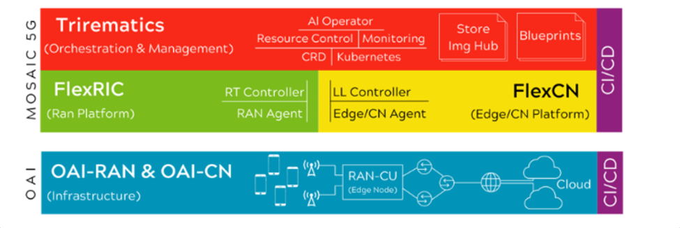
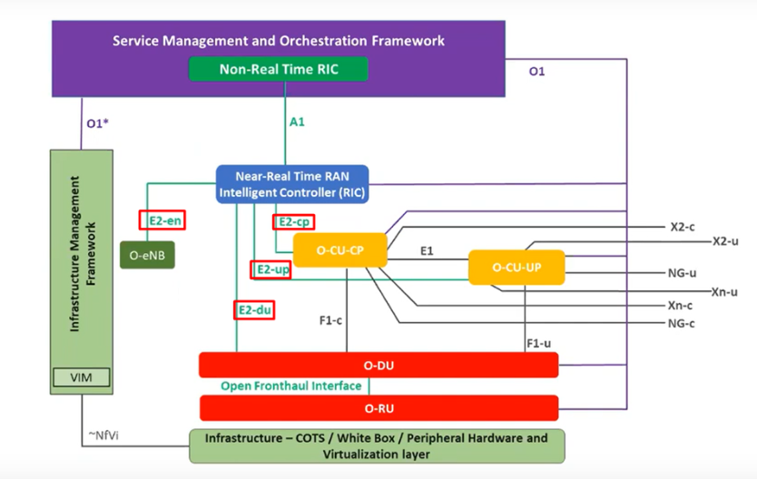
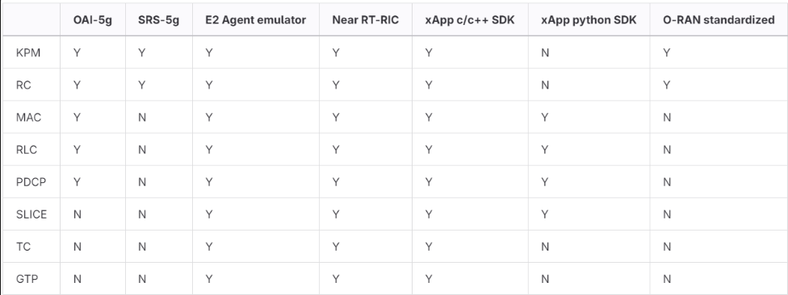
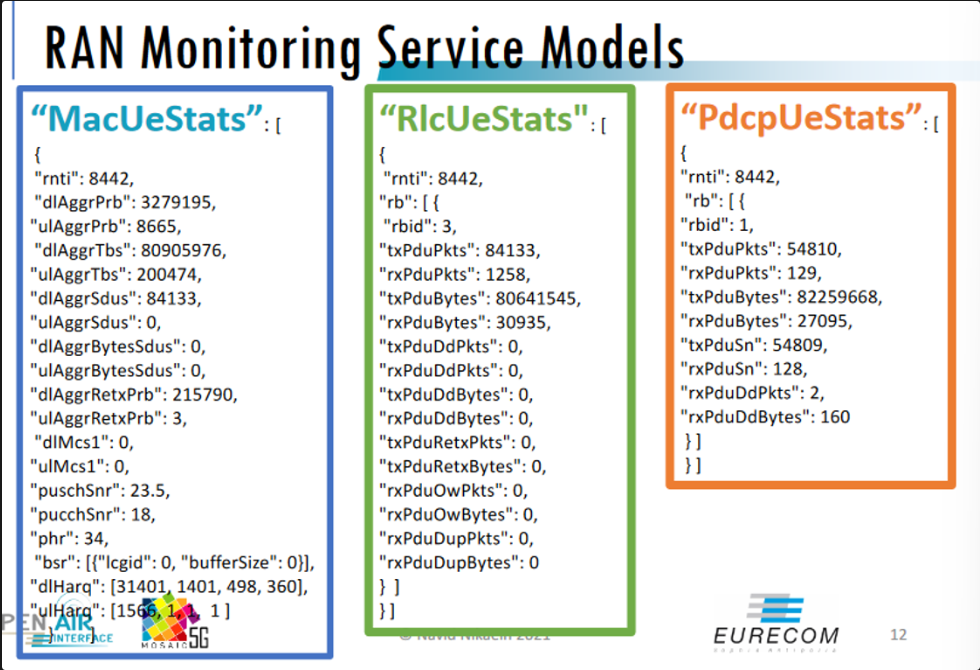
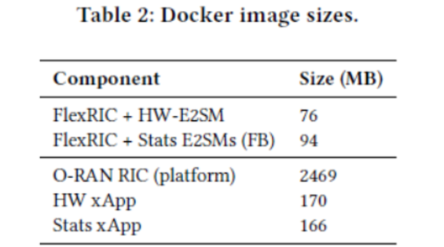
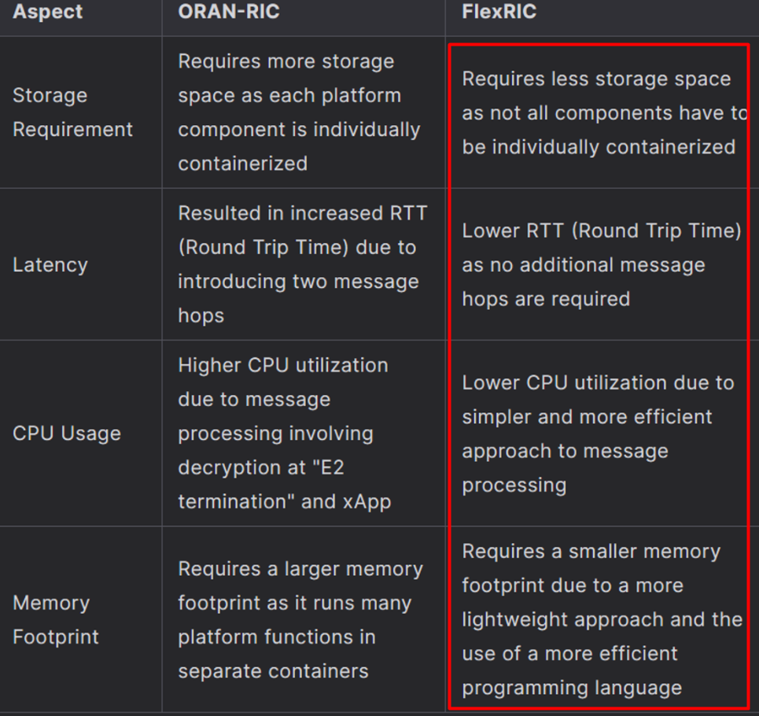
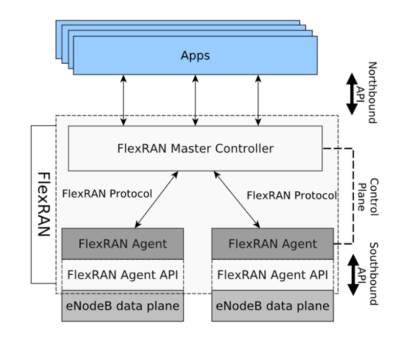
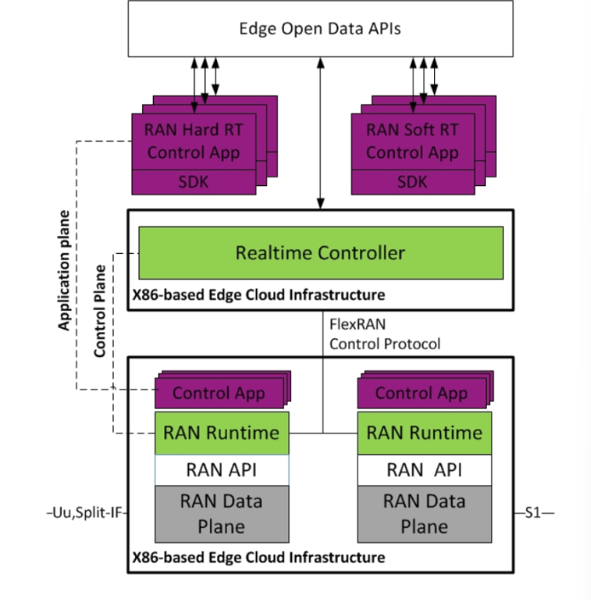
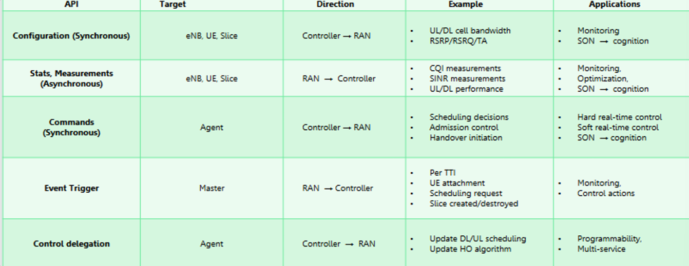

# FlexRIC: (SD-RAN):

The FlexRIC is a component of the Mosaic5G project → with the objective of providing an ecosystem of open source 4G/5G service platforms, towards Open RAN and Open CN: openness and interoperability between equipment from different vendors.

FlexRIC follows the Mosaic5G design principles to be multi-RAT, multi-vendor and multi-service.

<aside>
💡 Flexible RIC (RAN Inteligent controller) and E2 Agent SDK

</aside>

  

The RIC is a central component in the O-RAN architecture. It is designed to bring flexibility to the control of the Radio Access Network (RAN). So flexRIC is designed in such a way that developers and network operators can create custom software-defined RAN controllers.

The E2 Agent SDK refers to the fact that it is also a Software Development Kit designed to facilitate the development of agents that use the E2 interface in the O-RAN architecture: 

<aside>
💡 E2 Interface: standard connection that enables comms between the RIC and the RAN hardware (gNodeB’s or eNodeB).

</aside>

**Also, the RIC uses these E2 interfaces to monitor and control the RAN in real-time.**

Adicionally we have the FlexCN, a separate component but with the same principles: SD-CN controller.

### Metrics and Features:

Features by component and per service model: 

- KPM (Key Performance Metric): This metric refers to key performance parameters measured in cellular networks, such as throughput, latency, or packet loss.
- RC (Radio Controller): The software component responsible for managing radio resources in the network, including frequency spectrum allocation and transmission power.
- RLC (Radio Link Control): A protocol in the radio control layer that is responsible for organizing reliable data transmission between base stations (BS) and user devices (UE).
- PDCP (Packet Data Convergence Protocol): A protocol in the packet datagram protocol layer responsible for data compression and decompression, as well as providing security functions in mobile networks.
- MAC (Medium Access Control): A protocol in the medium access control layer that regulates access to physical channels in cellular networks, including time and frequency allocation.
- SLICE: This term refers to the concept of network slicing in 5G networks, where the network infrastructure can be divided into virtual chunks that can be organized independently to support different types of services with different qualities.
- TC (Traffic Classifier): A component used to classify network traffic based on certain types or characteristics, such as application or service type.
- GTP (GPRS Tunneling Protocol): A protocol used to transmit data packet traffic between nodes in a mobile network, such as between gateway nodes and base nodes.

**These are some of the RAN monitoring service models (examples):** 

  

*Also, FlexRIC from a memory and storage stanpoint:*

  

- Fine-grained monitoring (thanks to advanced service models)
- Slicing control, traffic control, mobility control
- Network store
- Realtime down to sub ms
- Extendable and plug-and-play service models
- Commmand line interface application
- Built using C/C++ and Python with support for x64 Linux Systems

  

# FlexRAN (SD-RAN):

As we already know, SDN or Software Defined Networking is one of the key technologies in 5G and evolving mobile networks. These SDN principals are normally acoumpanied by: 

- Separation of control plane and data plane via a well defined API
- Support for real-time control (essencial to many RAN operations)
- Easily implement new control functions
- Dynamically adapt the control scheme to the network requirements

<aside>
💡 Essencially, what we look forward is a platform that can perform all these operations

</aside>

The **FlexRAN** platform is made up of two main components: FlexRAN Control Plane & FlexRAN Agent API. 

  

The FlexRAN control is composed by a **Master Controller** connected to a number of **FlexRAN Agents -** one connected to each eNodeB. The FlexRAN Agent API acts as a southbound API → interface that connects and communicates with components that are lower in the hierarchy. 

*Note: the Master Controller can also be denominated as Real-Time Controller?*

For the communication between the master controller and the agents we have the FlexRAN Protocol.

> *In one direction, the agent sends relevant messages to the master with eNodeB statistics, configurations and events, while in the other direction the master can issue appropriate control commands that define the operation of the agents.*
> 

On top we have a northbound API which allows RAN Apps to control and modify the state of underlying components such as eNodeBs and UEs based on **statistics and events gathered from the eNodeBs in the FlexRAN control plane.** 

**Flow of operations:** 

- **FlexRAN Agent**: This component collects statistics and notifications (protocol messages) from the underlying network or RAN. These messages contain essential data about the network's current state.
- **RIB Updater**: The FlexRAN Agent sends the collected stats and notifications to the RIB Updater. The RIB Updater processes these inputs and generates the necessary updates for the RIB.
- **RIB (Routing Information Base)**: The RIB stores the current state and configuration of the network. The RIB Updater makes RIB update calls to modify the RIB's content based on the latest data from the FlexRAN Agent.
- **Events Notification Service**: This service monitors the RIB and responds to any changes or queries made by applications. It is responsible for notifying applications about significant events or changes in the RIB.
- **Application**: The application queries the RIB to get the current state or configuration of the network. It relies on the Events Notification Service to stay updated on any changes to the RIB that might affect its operation.

RAN control applications can be developed both on the top of the RAN runtime and RTC SDK allowing to monitor, control and coordinate the state of RAN infrastructure. Such applications could vary from soft real-time application including monitoring that obtain statistics reporting to more sophisticated distributed applications that modify the state of the RAN in real-time (e.g. MAC scheduler). All the produced RAN data and APIs are open to be consumed by 3rd parties.

  

- Plug & Play control apps
    - SDK for App-to-App and App-to-RAN
- FlexRAN Master Controller
    - Top level controller/orchestrator
    - eNB/UE state and resources
- FlexRAN Runtime
    - Abstraction and programmability of network functions
    - Extendable RAN APIs
    - Virtualized resources and states
    - Local controller
    - Support for heterogeneous deployments
- FlexRAN Protocol
    - Statistics
    - Configurations
    - Commands
    - Event Trigger
    - Control delegation

### Metrics and Features:

- Control and data plane separation
- Centralized & real-time control: control plane is centralized which simplifies coordination among BS
- Virtualized Control Functions
- Control Delegation & policy reconfiguration: dynamic delegation of control functions and real time reconfiguration of their behavior - also can be implemented using non real time configurations and operations
- User Equipment (UE) Transparency: full transparency to the user equipment ensuring compatibility
- Support of RAN, Content and Device/Provider optimization use cases
- Built using C++ with support for x64 Linux Systems (Master Controller); C for the agent.

**Protocol API:** 

